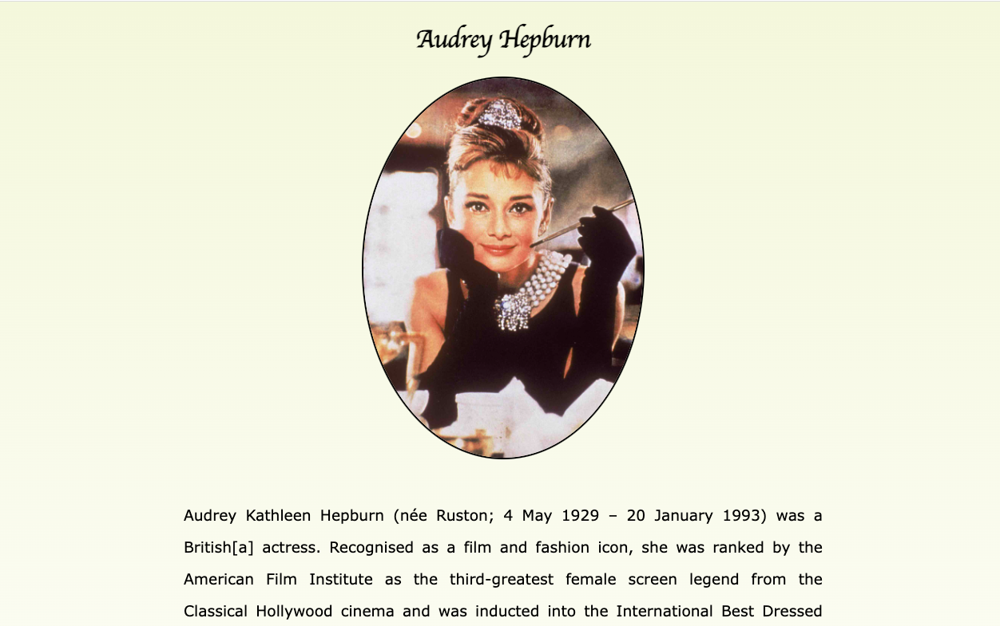

# Audrey Hepburn Biography Project

Welcome to the Audrey Hepburn Biography Project! This marks the beginning of my journey on GitHub, where I am thrilled to present a short yet captivating biography about one of the most iconic actresses in the world - Audrey Hepburn. Leveraging the power of HTML and CSS, I've crafted a tribute webpage that highlights her life, achievements, and lasting influence.

## Introduction

This project is a heartfelt homage to Audrey Hepburn, a legendary actress, and a timeless fashion icon. Through this webpage, I aim to capture the essence of her remarkable journey in the film industry and her impactful humanitarian work. As a beginner's project, it showcases my journey into the realms of HTML and CSS, while also celebrating the elegance and grace that Audrey Hepburn epitomized.

## Technologies Used

- HTML5
- CSS3

## Usage

Feel free to explore the webpage to discover intriguing insights about Audrey Hepburn's life, her cinematic achievements, and her contributions beyond the silver screen. The webpage aims to provide a succinct yet captivating overview, complemented by carefully selected images.

## Get in Touch

Connect with me on LinkedIn <a href="https://www.linkedin.com/in/ana-paulaguerrero/">
